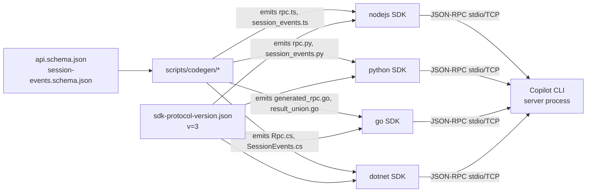

# Phase 1A — Broad Survey

**Target:** `/mnt/disk1/zy/internal_wiki/.git-clones/copilot-sdk`
**Git SHA:** `a3e273c` (tag `v0.3.0-preview.0`)
**Generated:** 2026-04-22

## 1. Project Nature

GitHub Copilot SDK — a multi-language client library that exposes the Copilot CLI's agent runtime as a programmable API. Applications embed Copilot's planning/tool/file-edit loop via **JSON-RPC** over stdio or TCP against a `copilot` CLI process running in server mode. Four SDKs (Node.js, Python, Go, .NET) plus a shared codegen pipeline and cross-SDK conformance test suite.

- **Protocol version:** 3 (`sdk-protocol-version.json`); minimum supported: 2
- **Release:** v0.3.0-preview.0 (public preview)
- **License:** MIT

## 2. File counts by language

| Language | Files |
|---|---|
| TypeScript (.ts) | 98 |
| Go (.go) | 85 |
| Python (.py) | 79 |
| C# (.cs) | 76 |
| Markdown (.md) | 94 |
| YAML (.yml/.yaml) | 178 |
| Shell (.sh) | 35 |
| **Total code** | ~338 |

Primary languages are evenly distributed — no single "primary" language because each SDK is a first-class citizen. For wiki language highlighting we default to `typescript` but key code snippets use per-SDK tags.

## 3. Depth Detection

Root directory contains 6 functional sub-directories with source files, 1 shared documentation tree, and 1 test harness:

| Top-level dir | Files | Has sub-modules? | Classification |
|---|---|---|---|
| `nodejs/` | 98 ts + configs | src/, samples/, examples/, scripts/, test/ | **L1 (flat-ish)** — src is thin (8 files), no deep nesting |
| `python/` | 79 py | copilot/, samples/, e2e/, scripts/ | **L1 (flat)** — copilot package is flat |
| `go/` | 85 go | internal/, cmd/, rpc/, embeddedcli/, samples/ | **L1** — meaningful subdirs (jsonrpc2, embeddedcli, flock, rpc) |
| `dotnet/` | 76 cs | src/, samples/, test/ | **L1 (flat)** |
| `scripts/` | 5 ts codegen + helpers | codegen/, corrections/, docs-validation/ | **L1-flat** — cross-SDK tooling |
| `test/` | YAML conformance fixtures | snapshots/, harness/, scenarios/ | **L1-flat** — conformance suite |
| `docs/` | 30 md | organized by topic | **L1-flat** — narrative docs hub |

**Chosen depth: 3-level** (L0 hub → L1 per module → optional L2/focus deep-dives for the most important components). Each language SDK shares the same ~10 source files in near-parallel shape, so L1 pages are rich but L2 fan-out is limited to the 2-3 components that warrant focus pages.

## 4. Module Classification

| Module | Role | Primary Entry | Lines of code |
|---|---|---|---|
| `nodejs` | TypeScript/Node.js SDK, reference implementation | `src/client.ts`, `src/session.ts` | ~5k |
| `python` | Async Python SDK (3.11+) | `copilot/client.py`, `copilot/session.py` | ~6.5k |
| `go` | Go SDK — idiomatic typed handlers | `client.go`, `session.go` | ~4.6k |
| `dotnet` | .NET 8.0+ SDK, System.Text.Json based | `src/Client.cs`, `src/Session.cs` | ~4.3k |
| `scripts` | TypeScript codegen from shared JSON schemas | `scripts/codegen/*.ts` | ~2k |
| `test` | Cross-SDK JSON/YAML snapshot conformance | `test/snapshots/**/*.yaml` | N/A (data) |
| `docs` | End-user docs (features, hooks, auth, setup) | `docs/getting-started.md` | (narrative) |

## 5. Cross-Module Dependencies

Four SDKs are peers — **no** direct source-level dependencies between them. The coupling is indirect:

1. **Shared wire protocol** — All four SDKs speak the same JSON-RPC method names, request/response shapes, and event types. The contract lives in `nodejs/node_modules/@github/copilot/schemas/{api,session-events}.schema.json` (shipped with the CLI binary).
2. **Shared protocol version** — `sdk-protocol-version.json` is the single source of truth; each SDK embeds it in a language-specific file (`sdkProtocolVersion.ts`, `_sdk_protocol_version.py`, `sdk_protocol_version.go`, `SdkProtocolVersion.cs`).
3. **Shared codegen** — `scripts/codegen/{typescript,python,go,csharp}.ts` read the same `api.schema.json` and emit `rpc.{ts,py,go,cs}` + `session_events.{ts,py,go,cs}` files into the `generated/` directory of each SDK.
4. **Shared conformance tests** — `test/snapshots/**/*.yaml` drives the same scenarios against every SDK to guarantee behavioural parity.

## 6. Language Auto-Detect

Distribution is 98 TS / 85 Go / 79 Py / 76 C#. No language passes 50% — this is a **polyglot** project. Wiki uses per-page language classes; L0/L1 defaults to `typescript` because the reference implementation + codegen live there.

## 7. Per-Module Broad Research Summary

### nodejs
- **Purpose:** Reference SDK. TypeScript, published as `@github/copilot-sdk`. Uses `vscode-jsonrpc` for RPC transport and `zod` for tool parameter schemas.
- **Key files:** `client.ts` (1990 lines), `session.ts` (1097), `types.ts` (1735), `sessionFsProvider.ts` (159), `generated/rpc.ts`, `generated/session-events.ts`.
- **Entry points:** `CopilotClient` class (manages CLI process, connection, sessions); `CopilotSession` class (per-conversation state, event pump, tool/permission/elicitation handlers).
- **Notable design:** `enableConfigDiscovery` auto-loads `.mcp.json` & skill dirs; `systemMessage` supports replace/customize/transform modes with callback-based section rewriting; bundled CLI via `createRequire` resolution.
- **Snippets to extract:** `CopilotClient` ctor, `createSession` method, `sendAndWait` race-free handler, `defineTool` wrapper.

### python
- **Purpose:** Async-native SDK, targets Python 3.11+. Async context manager pattern (`async with CopilotClient()`).
- **Key files:** `client.py` (2730), `session.py` (2047), `_jsonrpc.py` (385 — threads + asyncio bridge), `session_fs_provider.py` (223), `tools.py` (327), `generated/rpc.py`, `generated/session_events.py`.
- **Notable design:** `_jsonrpc.py` uses blocking stdin/stdout reads on dedicated threads to avoid asyncio subprocess pitfalls on Windows. Pure-Python JSON-RPC (no `vscode-jsonrpc` equivalent). `TypedDict` for payloads; dataclasses for options. BYOK via env vars + `ExternalServerConfig`.
- **Snippets to extract:** `JsonRpcClient` ctor, `create_session` signature, `SessionFsProvider` ABC, `define_tool` helper.

### go
- **Purpose:** Go SDK — compiled-to-binary, idiomatic generics in `DefineTool[T, U]`. Supports stdio + TCP.
- **Key files:** `client.go` (1814), `session.go` (1270), `types.go` (1213), `definetool.go` (232), `permissions.go` (13), `internal/jsonrpc2/*.go` (custom JSON-RPC impl), `internal/embeddedcli/`, `internal/flock/flock_{unix,windows,other}.go` (cross-platform file locking for bundled CLI), `rpc/generated_rpc.go`, `rpc/result_union.go`.
- **Notable design:** Generics for type-safe tool handlers; platform-specific file-lock to serialise CLI extraction; own JSON-RPC framing (`internal/jsonrpc2/frame.go`) rather than a third-party lib; `atomic.Pointer` for process handle, `sync.Mutex` + `sync.RWMutex` for lifecycle.
- **Snippets:** `NewClient`, `DefineTool` generic signature, `jsonrpc2.Request/Response` structs, `flock_unix` syscall.

### dotnet
- **Purpose:** .NET 8.0+ SDK; nullable-reference-types enabled; NuGet package `GitHub.Copilot.SDK`.
- **Key files:** `src/Client.cs` (1936), `src/Session.cs` (1283), `src/Types.cs` (2723), `src/SessionFsProvider.cs` (216), `src/PermissionHandlers.cs` (13), `src/Generated/Rpc.cs`, `src/Generated/SessionEvents.cs`, `src/MillisecondsTimeSpanConverter.cs` (custom JSON converter).
- **Notable design:** `System.Text.Json` with source-generated converters for discriminated unions; `IAsyncDisposable` for client/session lifetimes; `Channel<T>` for streaming event delivery; explicit `CancellationToken` on every async method.
- **Snippets:** `CopilotClient.StartAsync`, `CreateSessionAsync`, `ActionDisposable`, `MillisecondsTimeSpanConverter`.

### scripts (codegen)
- **Purpose:** Generate the `generated/` sub-tree of each SDK from shared JSON Schemas (api + session-events) shipped with the Copilot CLI.
- **Key files:** `codegen/utils.ts` (schema loader, REPO_ROOT path resolution, post-processing), `codegen/typescript.ts`, `codegen/python.ts`, `codegen/go.ts`, `codegen/csharp.ts` — each emits language-specific bindings.
- **Notable:** `json-schema-to-typescript` for TS; `quicktype` via `execFile` for Python/Go/C#; custom post-processing (nullable refs, boolean consts → enum, alphabetical property sort for deterministic output). Drives the shared wire-protocol contract. `corrections/` folder contains hand-patched regions that codegen can't infer.

### test (conformance)
- **Purpose:** Cross-SDK conformance test suite. YAML scenarios describe input prompts + tool-result expectations; the harness runs them against every SDK and diffs against stored snapshots in `test/snapshots/`.
- **Folders:** `snapshots/tool_results`, `snapshots/builtin_tools`, `snapshots/ask_user`, `snapshots/permissions`, `snapshots/streaming_fidelity`, `snapshots/session_fs`, `snapshots/hooks_extended`, `snapshots/skills`, `snapshots/mcpservers`, `snapshots/compaction`, `snapshots/system_message_transform`, `snapshots/multi_client`, etc.
- **Notable:** Single source of behavioural truth; new feature ⇒ add YAML fixture ⇒ all 4 SDKs implement until snapshots match.

### docs
- **Purpose:** Narrative product docs (not code). Features, auth, hooks, setup, troubleshooting, observability, integrations.
- **Structure mirrors user journey:** getting-started → features → hooks → setup → troubleshooting → integrations. MAF integration called out as featured integration.

## 8. Configuration / Knobs (cross-SDK)

| Knob | Default | Controls |
|---|---|---|
| `CLIUrl` / `cliUrl` | — (spawn subprocess) | Connect to existing CLI server instead of spawning |
| `CLIPath` / `cliPath` | bundled | Override CLI binary path |
| `model` | CLI default | Which model to use for the session |
| `enableConfigDiscovery` | `false` | Auto-load `.mcp.json` + skill dirs from CWD |
| `onPermissionRequest` | deny all | Tool/command permission callback |
| `commands` | `[]` | Slash-command registry |
| `tools` | `[]` | Custom tool list |
| `systemMessage` | CLI default | replace / customize / transform modes |
| `onElicitationRequest` | — | Interactive UI callbacks |
| `sessionFs` | — | Virtual filesystem provider |
| `initialCwd` | process CWD | Starting working dir (for SessionFs + infinite sessions) |
| `hooks` | — | PreToolUse/PostToolUse/UserPromptSubmitted/SessionLifecycle |
| `reasoningEffort` | model default | low/medium/high |
| `traceContextProvider` | — | W3C Trace Context propagation for telemetry |
| `COPILOT_GITHUB_TOKEN` / `GH_TOKEN` / `GITHUB_TOKEN` | — (env) | Auth for non-interactive use |
| `OPENAI_API_KEY` et al. | — (env) | BYOK provider keys |

## 9. Terminology

- **Client** — manages CLI process lifecycle & the JSON-RPC connection. One per application.
- **Session** — one conversation. A Client can host multiple concurrent Sessions.
- **Turn** — one user prompt → assistant response cycle. Includes 0..N tool invocations.
- **Tool** — a named function (your code) Copilot can invoke via the agent loop. Defined with a JSON-Schema parameter spec.
- **Permission request** — a pre-execution hook: Copilot asks your app "may I run tool X with args Y?"
- **Elicitation** — interactive UI (confirm/select/input) the agent drives while mid-turn.
- **Hook** — user-supplied interceptor: `preToolUse`, `postToolUse`, `userPromptSubmitted`, `sessionLifecycle`, `onError`.
- **Skill** — a reusable prompt module loaded from a directory (e.g., `~/.copilot/skills/pdf/`). The SDK passes the skill dir through to the CLI.
- **MCP server** — Model Context Protocol provider; the CLI manages sub-process lifecycles and exposes the tools back through the session.
- **Custom agent** — a named sub-agent with its own system prompt + tool allow-list; invokable via `@name` inside a conversation.
- **Session FS** — optional virtual filesystem layer; the CLI reads/writes via SDK-supplied `SessionFsProvider` instead of the real disk.
- **Infinite session** — sessions with a persistent workspace directory (`checkpoints/`, `plan.md`, `files/`) that survive process restarts.
- **Steering** — sending a new prompt mid-turn without waiting for idle; preempts in-flight work.
- **Queueing** — default delivery: wait for `session.idle` before accepting the next prompt.
- **Compaction** — CLI-side summarisation when the context window fills up.
- **BYOK** — Bring Your Own Key; use provider API keys (OpenAI/Anthropic/Azure AI Foundry) in lieu of GitHub auth.
- **System message modes** — `replace`, `customize` (per-section override), `transform` (callback rewriting).
- **W3C Trace Context** — `traceparent`/`tracestate` headers propagated from the app into CLI telemetry.
- **Protocol version** — integer in `sdk-protocol-version.json`; mismatches trigger a capability downgrade or refusal.
- **ForegroundSessionInfo** — metadata returned when listing visible sessions on a shared CLI server.

## 10. Architectural Patterns

| Pattern | Where | Why |
|---|---|---|
| **Façade over JSON-RPC** | every `Client`/`Session` | Hides wire-format from user; exposes language-idiomatic method names |
| **Shared-schema codegen** | `scripts/codegen/` | Four SDKs can't drift because all derive from the same JSON Schema |
| **Async context manager / IDisposable** | Python (`async with`), .NET (`IAsyncDisposable`), Go (`defer client.Stop()`) | Deterministic CLI process cleanup; the one resource you MUST release |
| **Typed event union** | `SessionEvent` discriminated union | 40+ event types; `type` field drives exhaustive switches |
| **Request/response + notification hybrid** | `vscode-jsonrpc` / custom jsonrpc2 | Calls expect replies, events are fire-and-forget notifications |
| **Callback-driven handlers** | permission, tool, elicitation, hooks | Inversion of control: user supplies functions, SDK invokes at the right moment |
| **Process bundling** | `nodejs` via npm dep, `python` via pip extras, `dotnet` via NuGet content files; `go` via `internal/embeddedcli` + flock | Removes "install the CLI separately" friction |
| **Platform-split files** | `go/process_{windows,other}.go`, `go/internal/flock/flock_{unix,windows,other}.go` | Go build-tag idiom for cross-platform syscalls |

## 11. Key Algorithms / Mechanisms

1. **Protocol version negotiation.** On connect, client sends its version; server replies with its own; both compute the minimum compatible. If the server version < client MIN (2), the client rejects. Enables graceful upgrade: new SDKs keep talking to older CLIs by disabling capability-gated features (e.g., "no-result" permission return value is only legal on v2+).

2. **Event pump with pre-registration race fix.** `sendAndWait` registers its `session.idle` listener *before* calling `send`; otherwise a fast idle event could fire between send and subscribe. This is visible in `nodejs/src/session.ts` L231-243 as an explicit comment.

3. **JSON-RPC framing — Content-Length headers.** All transports use LSP-style framing: `Content-Length: N\r\n\r\n` + N-byte JSON body. `vscode-jsonrpc` on Node, custom `internal/jsonrpc2/frame.go` on Go, `_jsonrpc.py` reads headers then body on a dedicated thread.

4. **File-lock-guarded CLI extraction (Go only).** `go/embeddedcli/installer.go` extracts the bundled CLI to a user cache dir. `internal/flock/flock_{unix,windows}.go` implements an advisory lock so parallel processes don't race on extraction.

5. **System-message `transform` wire trick.** User supplies JS/TS callbacks; SDK can't send functions over JSON-RPC, so it sends `{ action: "transform" }`, keeps callbacks in a side map, and invokes them when the server round-trips a `sections.transform` request.

6. **Schema post-processing in codegen.** `scripts/codegen/utils.ts` converts `const: boolean` to `enum: [true]` (quicktype hates boolean consts), rewrites nullable `$ref`s (TS-native null-coalescing doesn't interact well with `additionalProperties: false`), and sorts properties alphabetically so diffs are deterministic across codegen runs.

## 12. Design Decisions Visible in Code

1. **Four SDKs, one protocol.** No shared runtime; every SDK reimplements JSON-RPC/lifecycle/types. Benefits: zero cross-language dependency chain, each SDK feels native. Cost: feature parity must be manually enforced (enter the conformance test suite).
2. **Codegen only for the wire contract.** Business logic (event handlers, permission flows, tool dispatch) is hand-written per SDK; only the RPC method names, parameter shapes, and event-payload types come from codegen.
3. **The CLI binary is the server.** Not an HTTP service, not a library — a sub-process managed by the Client. Eliminates a whole class of "is the server healthy" problems by using OS process semantics (exit code, pipe close = dead).
4. **Protocol versioning via a single integer.** `sdk-protocol-version.json` — no semver on the wire, no minor/major split, just "v2" vs "v3". The matrix of what-works-with-what is kept small and explicit.
5. **Capabilities object instead of feature probes.** Servers tell clients what they support (`session.capabilities.ui.elicitation`, etc.) rather than clients probing by attempting calls. Means one round trip instead of many.
