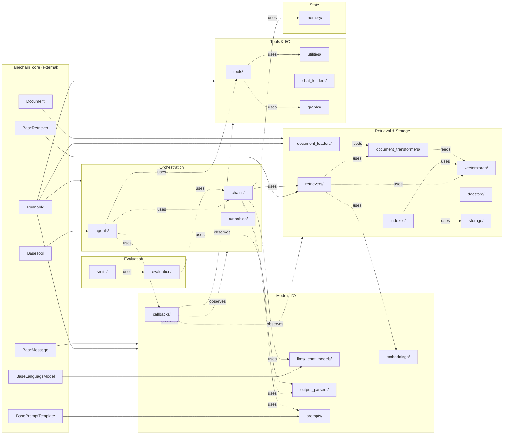

# Phase 1C — Cross-Module Synthesis

## End-to-end flows

### Flow 1 — Conversational RAG with citations

User asks a question in a chat UI. The system retrieves relevant docs, answers with the LLM, and stores the turn for follow-up questions.

```
User input
   │
   ▼
chat history (memory.ChatMessageHistory)
   │
   ├──► history-aware rephrase  (chains.history_aware_retriever)
   │      └── prompt | LLM | StrOutputParser  ──► standalone question
   │
   ▼
retriever (retrievers.MultiQueryRetriever wrapping vectorstores.Chroma)
   │      └── LLM expands to N variants
   │      └── each variant → similarity_search → fuse via dedupe
   ▼
docs (list[Document])
   │
   ▼
contextual compression (retrievers.ContextualCompressionRetriever)
   │      └── EmbeddingsFilter → LLMChainExtractor
   ▼
answer chain (chains.create_stuff_documents_chain)
   │      └── prompt-with-{context} | LLM | StrOutputParser
   ▼
answer + cited docs
   │
   ├──► memory.save_context({"input": q}, {"output": a})  → updates ChatMessageHistory
   │
   ▼
response to user
```

**Touched modules.** `memory/`, `chains/`, `retrievers/`, `vectorstores/`, `document_compressors/` (under retrievers/), `output_parsers/`, `callbacks/` (instrumenting every step).

**Total LLM calls.** Typically 3 — rephrase, multi-query expand, answer. Plus optional compression LLM call.

**Key insight.** This entire flow is now expressible in LCEL: `history_aware | retriever | compress | stuff`. The classic `Chain`-class equivalents still exist for legacy code.

### Flow 2 — Tool-calling agent answering "what's the weather in Paris and convert to F?"

```
input → AgentExecutor.invoke({"input": q})
          │
          ▼ (loop iteration 1)
       prompt = ChatPromptTemplate(system, MessagesPlaceholder("history"),
                                    HumanMessage(q),
                                    MessagesPlaceholder("agent_scratchpad"))
          │
          ▼
       prompt | llm.bind_tools(tools) | OpenAIToolsAgentOutputParser
          │      └── llm returns tool_calls=[get_weather(city="Paris")]
          ▼
       AgentAction("get_weather", {"city": "Paris"}, log=…)
          │
          ▼
       AgentExecutor calls tools["get_weather"].arun({"city":"Paris"})
          │      └── utilities.GoogleSearchAPIWrapper or open-meteo HTTP
          ▼
       observation = "21 °C, partly cloudy"
       intermediate_steps.append((action, observation))
          │
          ▼ (loop iteration 2)
       same prompt with new scratchpad
          │
          ▼
       LLM returns tool_calls=[convert_temperature(value=21, from="C", to="F")]
          │
          ▼ … observation = "69.8 °F"
          │
          ▼ (loop iteration 3)
       LLM returns AgentFinish(return_values={"output": "Paris is 21 °C / 69.8 °F"})
          │
          ▼
       AgentExecutor returns {"input": …, "output": …, "intermediate_steps": [...]}
```

**Touched modules.** `agents/`, `tools/`, `chat_models/`, `prompts/` (MessagesPlaceholder), `output_parsers/`, `callbacks/`.

**Key insight.** All loop control lives in `AgentExecutor`. The agent itself is a stateless Runnable; the executor passes `intermediate_steps` back in on each iteration.

### Flow 3 — Indexing a documentation site

```
loader = WebBaseLoader([...])           # document_loaders
docs = loader.lazy_load()
splits = RecursiveCharacterTextSplitter(...).split_documents(docs)   # text_splitter

embedder = CacheBackedEmbeddings.from_bytes_store(
    OpenAIEmbeddings(), LocalFileStore("./cache"), namespace="docs"
)                                                # embeddings + storage
vs = Chroma(embedding_function=embedder, persist_directory="./db")   # vectorstores

record_manager = SQLRecordManager("docs", db_url="sqlite:///rm.db")
record_manager.create_schema()                          # indexes

result = index(
    splits, record_manager, vs, cleanup="incremental", source_id_key="source"
)                                                       # indexes
# {"num_added": 142, "num_updated": 7, "num_deleted": 3, "num_skipped": 1820}
```

**Touched modules.** `document_loaders`, `text_splitter`, `embeddings`, `storage`, `vectorstores`, `indexes`.

**Key insight.** The `record_manager + index()` pair is what makes this idempotent. Without it, every run would re-embed every document.

### Flow 4 — Evaluating an agent on a dataset

```
run_on_dataset(
    dataset_name="my-dataset",
    llm_or_chain_factory=lambda: AgentExecutor(...),
    evaluation=RunEvalConfig(evaluators=[
        RunEvalConfig.LabeledCriteria("correctness"),
        RunEvalConfig.AgentTrajectory(),
    ]),
)
   │
   ▼
LangSmith pulls dataset rows → for each, factory() builds a fresh chain
   │                          └── this isolation prevents memory leaks across rows
   ▼
chain.invoke(row.input) under tracing
   │
   ▼
LangChainTracer (callbacks) streams runs to LangSmith
   │
   ▼
For each evaluator: load_evaluator(...) → evaluate_strings/evaluate_run
   │      └── criteria evaluator: LLM judge with CoT
   │      └── trajectory evaluator: rates tool-use correctness
   ▼
Feedback rows stored against the run
```

## Coupling analysis

| Coupling pair | Mechanism | Tightness | Why |
|---|---|---|---|
| `chains` ↔ `prompts` | Chain holds a `BasePromptTemplate` | Tight | Templates are core abstractions; nearly every chain has one |
| `agents` ↔ `tools` | `AgentExecutor.tools: list[BaseTool]` | Tight at the type level, loose at the runtime: tools are interchangeable behind `BaseTool` |
| `agents` ↔ `output_parsers` | Pluggable per agent flavour | Loose | Strategy pattern; each parser implements `AgentOutputParser` |
| `chains` ↔ `memory` | `chain.memory` attribute | Loose | Optional; Chain works without memory |
| `retrievers` ↔ `vectorstores` | Strategy holds a `BaseRetriever`, often `VectorStoreRetriever` | Loose | Retriever can wrap any retriever, not just vectorstore-backed |
| Everything ↔ `callbacks` | `BaseModel.callbacks` field, manager passed through | Loose | Optional; defaults work with no callbacks |
| Everything ↔ `langchain_core` | Imports of Runnable/BaseMessage/Document | Tight | Core is the contract surface |
| `langchain_classic.{llms,chat_models,…}` ↔ `langchain_community` | `__getattr__` trampoline | Loose at import time, tight at runtime | Lazy resolution |
| `chains/graph_qa` ↔ `graphs/` | Direct imports | Tight | Graph-specific |
| `evaluation/criteria` ↔ `chains/` | `LLMChain` for the judge | Tight | The judge is itself an LLMChain |

## Architectural philosophy

1. **Composition over configuration.** Chains compose; agents compose with tools; retrievers wrap retrievers. Configuration flags are reserved for orthogonal concerns (verbose, callbacks, max_iterations).
2. **Pluggable strategies behind small ABCs.** `BaseTool`, `BaseRetriever`, `BaseMemory`, `BaseOutputParser`, `AgentOutputParser`, `BaseDocumentCompressor`, `BaseChatMessageHistory`, `ByteStore`, `RecordManager`, `Embeddings`, `BaseLLM`, `BaseChatModel`. Every notable axis of variation is an ABC.
3. **Evidence:** Pydantic-typed I/O. Dict-based I/O at the chain boundary lets callers introspect; Pydantic models inside ABCs catch wiring mistakes at construction time.
4. **Callbacks everywhere.** No code is unobservable. Even tools have callbacks. This is a deliberate observability tax — you pay a tiny per-call overhead and get streaming + tracing + cost accounting for free.
5. **Backward compatibility is a feature.** Re-export shims (`schema/`, `prompts/`, `tools/`), lazy trampolines (`llms/`, `chat_models/`), `@deprecated` decorators, and side-by-side legacy + factory APIs (`AgentType` enum + `create_*_agent` factories; `Chain` subclassing + `create_*_chain` LCEL factories) all reflect a project that values stability for users on old code paths.
6. **LCEL is the future, classic is the museum.** Many newer constructors (`create_retrieval_chain`, `create_history_aware_retriever`, `create_stuff_documents_chain`, `create_*_agent`) return Runnables. The legacy `Chain` and `Agent` classes remain for compat but new code is encouraged toward LCEL.

## Shared state inventory

- **Process-globals (`globals.py`):** `verbose`, `debug`, `llm_cache`. Set once at boot; consulted by every chain/agent. The convenience comes at the cost of test isolation — tests must reset.
- **Inheritable callbacks:** `RunnableConfig.callbacks` propagate through child runs, forming the run tree LangSmith renders.
- **Memory:** Owned by the chain; not shared between chains unless explicitly passed.
- **Vectorstores / record managers:** External, shared across processes; the indexing API treats them as ground truth.

## System evolution

- **Layer 1 — Core (Aug 2022):** `Chain`, `LLM`, `PromptTemplate`. Single repo. Everything in one place.
- **Layer 2 — Agents (Oct 2022):** ZERO_SHOT_REACT_DESCRIPTION agent + `Tool`. The act-observe loop is invented.
- **Layer 3 — Retrievers (early 2023):** Vectorstore explosion + `BaseRetriever` ABC. RAG becomes a first-class pattern.
- **Layer 4 — Memory (mid 2023):** `BaseMemory` accumulates flavours: Buffer → Window → Summary → KG → VectorStore.
- **Layer 5 — LCEL (late 2023):** `Runnable` ABC, `|` composition, streaming as a first-class concern. Many `Chain`s become wrappers over LCEL.
- **Layer 6 — Package split (early 2024):** Core / community / classic / provider packages. `langchain_classic` becomes the home of pre-LCEL code + classic-only constructors.
- **Layer 7 — Modern factory APIs (2024–):** `create_*_agent`, `create_*_chain`, `init_chat_model`, `RunnableWithMessageHistory`. The legacy classes persist; new code is steered to factories.

The "core" — most stable, most depended on — is `langchain_core` (not in this repo). Inside `langchain_classic`, the most stable layer is `chains/base.py`, `agents/agent.py`, `BaseMemory`, `BaseRetriever`. The most evolutionary churn is at the surface (factory functions, agent flavours).

## Connection diagram


